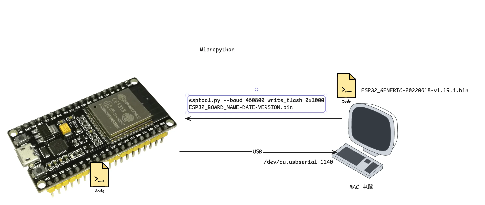
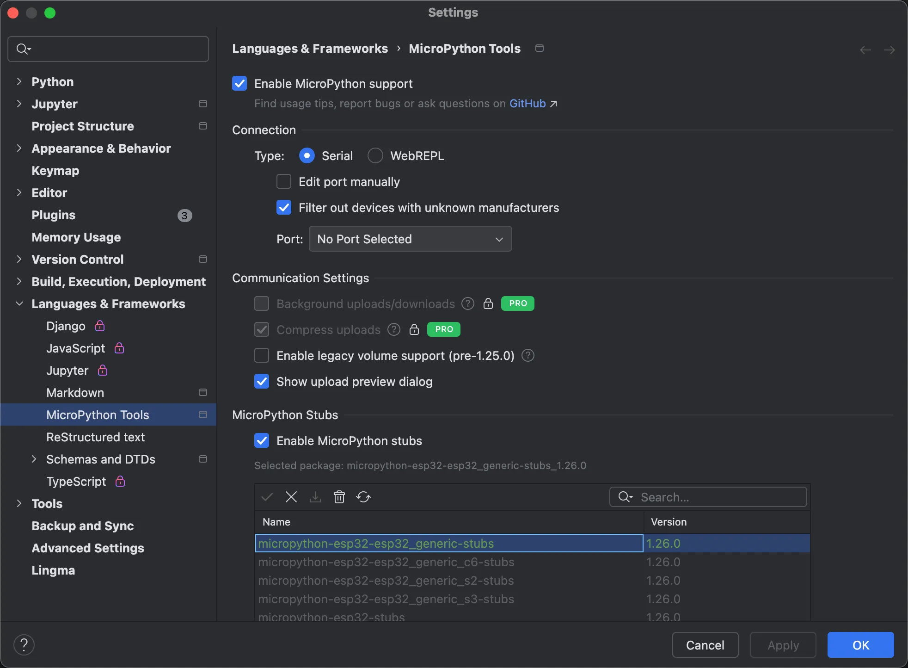

<p align="center">
  
  
  
  
  
  
</p>

# 开发环境
## 一、环境搭建（以ESP32-WROOM型号为例）

MicroPython固件刷入链接

- 固件下载地址：https://micropython.org/download/
- ESP32通用固件：https://micropython.org/download/ESP32_GENERIC/
- 官方文档参考：https://docs.micropython.org/en/latest/esp32/quickref.html

```shell
conda create --name esp32 python=3.7
pip install esptool  # 自动安装最新兼容版本（4.x+）

esptool.py erase_flash
esptool.py --baud 460800 write_flash 0x1000 ESP32_BOARD_NAME-DATE-VERSION.bin


```

MicroPython 并不严格对应标准 Python 的某个具体版本（如 3.4），但它的语法和核心特性主要基于 Python 3.4 至 Python 3.6 的特性集，同时针对嵌入式设备的资源限制做了精简和优化。
具体说明：
1. 核心语法基础
MicroPython 遵循 Python 3 的语法规范（而非 Python 2），支持 print() 函数、类型注解、async/await 异步语法等 Python 3 的核心特性。这些特性主要对应 Python 3.4 到 3.6 之间的版本（例如，async/await 在 Python 3.5 中正式引入，MicroPython 也支持类似语法）。
2. 与标准 Python 的差异  
  ○ MicroPython 为了适配嵌入式设备（如 ESP32）的有限内存和计算资源，精简了标准库（例如，没有 tkinter、multiprocessing 等桌面级模块）。  
  ○ 增加了硬件控制专属模块（如 machine 模块用于 GPIO、PWM、ADC 等硬件操作）。  
  ○ 部分语法和函数实现略有简化（例如，字符串格式化、异常处理的细节）。
3. 版本兼容性
对于 ESP32 上的 MicroPython，你无需纠结它“对应”标准 Python 的哪个版本——只要你的代码符合 Python 3 的基本语法（避免使用 Python 3.7+ 才引入的新特性，如 walrus operator :=），基本都能在 MicroPython 上运行。例如：  
  ○ 支持 f-string（Python 3.6 引入），但早期 MicroPython 版本可能不支持；  
  ○ 不支持 Python 3.8+ 的 positional-only parameters 等较新特性。
总结：
MicroPython 基于 Python 3 的语法和特性，核心功能接近 Python 3.4~3.6，但并非严格等同于某个版本。开发时只需遵循 Python 3 的通用语法，并注意 MicroPython 对标准库的精简和硬件模块的扩展即可。
如果你是在 ESP32 上使用 MicroPython，无需关心本地 Conda 环境的 Python 版本（只要工具链如 esptool 能运行即可），因为 MicroPython 固件本身是独立的嵌入式解释器，与你的电脑 Python 版本无关。
## Thonny 下载与安装
- 方式一：直接下载安装（官网获取对应系统版本）
- 方式二：通过pip命令安装（终端执行pip install thonny）
## pycharm 开发ESP32
`2025前的版本，好像不支持通过plugin要搜索到 micropython-tools`

使用插件： [micropython-tools-jetbrains-pro-2025.3.1](https://plugins.jetbrains.com/plugin/26227-micropython-tools/versions/stable)

需要开启以下的配置



## ESP32 datasheet
● 文档链接：https://documentation.espressif.com/esp32-s2_datasheet_en.pdf


# esp32-wroom-practice
ESP32-WROOM 实战练习：按键/旋钮编码器、HC-SR04 超声波、PIR（SR505）、干簧管、激光模块与 OLED 显示的示例与工具集。


| 文件名                  | 使用的硬件/ESP 外设                                | 主要作用/说明（要点）                                                                     |
| -------------------- | ------------------------------------------- | ------------------------------------------------------------------------------- |
| `lib/i2c_lcd_min.py` | **I²C 字符屏 LCD1602/2004（PCF8574 扩展板）**       | 最小驱动：初始化、清屏、写字符/光标控制；走 I²C 总线，供 `main_lcd1602.py` 调用。                           |
| `lib/ssd1306.py`     | **SSD1306 OLED（I²C/SPI 版常见 128×64/128×32）** | OLED 图形/文字驱动，提供绘图与文本 API；通常与测距/编码器示例联动显示。                                       |
| `lib/tm1637.py`      | **TM1637 4 位数码管**（CLK/DIO 两线）               | TM1637 数码管驱动，显示数字/档位/计数值；可能被 `main_gear.py` 等示例使用。                              |
| `lib/sdcard.py`      | **MicroSD 卡（SPI）**                          | SPI SD 卡块设备驱动，挂载到 VFS 进行读写日志/数据记录。                                              |
| `main_distance.py`   | **HC-SR04 超声波测距** +（常与 **SSD1306 OLED** 联动） | 非阻塞测距，实时显示距离/状态（通常在 OLED 上）。注意 Echo 需做 5V→3.3V 电平匹配或用 3.3V 兼容模块（如 SR04P）。       |
| `main_gear.py`       | **TM1637 数码管**（推断）/或“档位模式演示”                | 通过按键/旋钮切换“档位/模式”，在 TM1637 或 OLED 上显示数值（推断自文件名 *gear*）。                          |
| `main_laser.py`      | **激光发射/传感模块**（数模/数字输入）                      | 控制激光管开关，读取接收端/比较器输出并显示状态/计数；你先前提到“使用 GPIO22”可在此示例中配置。                           |
| `main_lcd1602.py`    | **LCD1602（I²C）** + `lib/i2c_lcd_min.py`     | 字符屏显示 Demo：初始化、打印多行文本/菜单。                                                       |
| `main_light.py`      | **光敏传感器（LDR/光照强度）→ ADC**                    | 采样模拟光照值（ADC），阈值判断/曲线显示（常配 OLED/串口日志）。                                           |
| `main_rotary.py`     | **旋钮编码器（KY-040 等）** +（常配 **SSD1306 OLED**）  | 读取旋转增量与**方向**、按钮按下；你之前给出接线：`SW=GPIO19, DT=GPIO21, CLK=GPIO22`，并在 OLED 上显示计数与方向。 |
